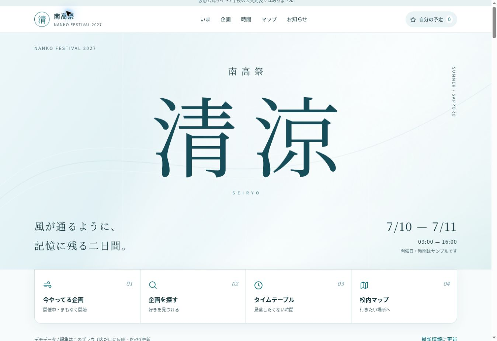

# 実操作レビューと改善記録

対象：公開サイト・運営CMS v2.1.1。2026年10月1日に、来場者と実行委員の操作を順に確認。
既存ルートサイトは変更せず、nankosai-seiryo/ 内だけを編集する。

## 実際に見つかった不便と対応

|状況|修正内容|
|---|---|
|吹奏楽部の詳細に同じ開催時刻が重複していた|関連時刻表の開催回だけを一度ずつ表示|
|時間・場所を変更しても企画カードや予定が元の情報だった|festival-data.js で開催回を共通化し、カード・詳細・予定・マップへ反映|
|中止したステージが終日企画として出る可能性|中止した開催回も保持し、開催中から除外。カード・予定へ中止を明示|
|予定に両日が混在し、当日の順序を見にくい|日付選択と「両日の予定をまとめて見る」を追加|
|お気に入りのステージが重なる|時間の重なる公演へ注意ラベル。終日展示は重複扱いにしない|
|場所の名前だけでは階が分からない|カード・時刻表・予定・詳細へフロアを併記|
|詳細からマップへ移った後、会場を見失う|正しいフロアと場所を選択し、SVGでも選択した部屋を強調|
|絞り込みの条件が折りたたみの中に隠れる|現在の条件・件数を常時表示し、ワンタップで解除|
|更新のたびに一覧を作り直すとフォーカスが消える|変更がある部分だけ描画し、同じ操作ボタンへフォーカスを保持|
|管理一覧の全角クラス名検索が一致しない|公開・管理で同じ検索正規化を使用。複数語にも対応|
|新規画面が保存する前から「保存済み」だった|新規・未保存・保存済み・復元済みを区別|
|下書き保存でも全項目が必須だった|名前だけで下書き保存。公開時に必要な情報を厳格に確認|
|長い編集画面で保存ボタンを見失う|公開状態付きの追従保存バー。スマホの管理ナビと重ならない配置|
|入力途中で再読み込みすると消える|SessionStorageへ一時保存。元データが更新されていれば自動で上書きせず選択させる|
|緊急告知・設定の編集中に移動できてしまう|未保存の移動確認と一時保存を追加。画像にも移動確認|
|保存成功後の再取得失敗を「保存失敗」と表示していた|書込結果と一覧取得を分離し、重複保存を招かない案内|
|保存が終わる前に追加入力すると、再描画で失う|保存中は入力をロックし、「保存中…」を明示|
|縦の短い画面では管理ナビが入力欄を圧迫する|高さ600px以下ではナビを追従させず、保存バーを画面上部へ保持|
|関連企画を使う新規時刻表の入力が煩雑|関連企画から名前・日付・時間・場所・カテゴリーを入力|
|公開中の参照先を下書きにすると会場・詳細が壊れる|公開中の企画・時刻表で参照されている場所・企画の下書き化を拒否|
|連続して画像を選ぶと先の圧縮結果が後から表示される|選択順を管理し、最新の選択だけを採用|
|画像選択の取り消しや不要画像の整理ができない|取り消しと未使用画像の削除を追加。使用中画像をUI・APIで保護|
|削除後に古い編集画面から保存してしまう|デモAPIでも削除済みIDを拒否し、GASと同じ挙動にする|
|変更後の新しいJSがPWAの事前保存に入らない|資材一覧と内容ハッシュからキャッシュ版を作るスクリプトを追加|
|公開更新後もブラウザが古いJSを使い、追加機能が読み込まれない|CSS・JS・ES Module依存先を同じ内容ハッシュの版付きURLに統一。PWAも版付きURLで保存し、全資材がそろってから切り替える|
|共有された企画URLから地図へ進んだ後、再読み込みすると企画詳細がまた開く|地図へ移動した時点で企画指定をURLから外し、`#map` と選択場所を保持する|

## 検証状況

- Node：36件成功。GAS認証・公開フィルター・下書き・参照保護・時刻・検索・PWAの通信失敗時の保存分への切替、画像削除の専用フォルダ・参照・revisionの保護、資材とModuleの版・参照先など。
- JavaScriptの構文はES Moduleとして検査する。`node --check --input-type=module < js/public-app.js`。
- 実ブラウザ手動操作：全角複数語検索、詳細、正しい場所への移動、お気に入り、重複予定、お気に入り時刻表、サンプル時刻、混雑更新、緊急バナー、下書き保存・公開除外、2タブ同時編集の先勝ち保存を確認。確認用データは元へ戻した。
- 改善後のGitHub Pages：65件成功・失敗0件。画像の選択・取消・1600px圧縮・保存・使用中保護・未使用削除、PWAのスコープ・版付き事前保存、全静的資材の404、地図遷移後URLまで確認。
- 公開資材版：`9fcad938b8a5`。確認したアプリケーションコード：`a0fc1a6791b75f771dd6935325281daec16b907a`。
- 対象幅：公開320 / 375 / 390 / 768 / 1440px、管理320 / 375 / 768 / 1440px。
- 実機iPhone Safari・Androidでの検証とGoogle APIへの実接続は未実施。Chromeの画面幅検証を実機検証とは呼ばない。

## 接続状態と続きの作業

API URLは空で、現在はデモモード。Sheetsの7シート・データ、Driveフォルダ、GASソースは準備済み。
Apps Scriptの本人による実行承認・パスワード設定・Web Appデプロイはまだ完了していない。
Google接続・Drive画像の実配信を完了したという報告はしない。

今回の公開版レビューで再現できた不具合は修正済み。次の実運用確認は、本人の承認後のGoogle API接続、Drive実画像、実機iPhone Safari・Android、端末をオフラインにした状態、実データを使う完全なキーボード導線を対象とする。

テスト画面はデモ限定で、検証中だけ専用のデータを使用する。終了時にこのサイトのLocalStorage・SessionStorageを元に戻す。
